[](https://dotnet.microsoft.com/) [](https://learn.microsoft.com/dotnet/maui) [](https://learn.microsoft.com/aspnet/core/blazor/hybrid) [](https://github.com/Adrianowsski/BudgetWise/actions) [](LICENSE)

# 💰 BudgetWise

A **cross-platform** personal finance manager built with **.NET MAUI + Blazor Hybrid**. Track expenses & income, set budgets, manage subscriptions, and hit your savings goals — online *or* completely offline with seamless API sync.

---

## 📌 Table of Contents

* [🚀 Key Features](#key-features)
* [🛠 Tech Stack](#tech-stack)
* [🏗 Project Structure](#project-structure)
* [⚙️ Installation & Setup](#installation--setup)
  * [Backend (Web API)](#backend-web-api)
  * [Mobile App](#mobile-app)
* [▶️ Running the App](#running-the-app)
* [📸 Screenshots](#screenshots)
* [📄 License](#license)

---

## 🚀 Key Features

* **Authentication**
  ASP.NET Core Identity + IdentityServer4 (JWT) for secure sign-up / login.
* **Dashboard**
  Summary KPI cards, *Income vs Expenses* line chart, category pie chart, active subscriptions.
* **Transactions CRUD**
  Filterable, sortable *Expenses* & *Incomes* with rich add/edit modals.
* **Monthly Budgets**
  Per-category limits with live usage bars.
* **Custom Categories & Types**
  User-defined expense categories (with emoji) & income types.
* **Savings Goals**
  Target amounts + deadlines, progress visualisation.
* **Subscriptions & Reminders**
  Manage recurring charges and receive local notifications.
* **Offline-First & Sync**
  SecureStorage caching, Polly retry/circuit-breaker, RESTful sync to SQL-backed API.
* **Clean Architecture**
  MVVM, DI, Blazor components, Behaviours, MessagingCenter.

---

## 🛠 Tech Stack

| Layer              | Technology / Library                              |
| ------------------ | ------------------------------------------------- |
| **Mobile UI**      | .NET MAUI + Blazor Hybrid, C#                     |
| **State & DI**     | CommunityToolkit.Mvvm, Microsoft Extensions DI    |
| **Charts & Icons** | Microcharts, FontAwesome / Material Icons         |
| **Storage**        | SecureStorage, Preferences                        |
| **Backend API**    | ASP.NET Core 9 + EF Core 9, SQL Server            |
| **Auth**           | IdentityServer4, ASP.NET Core Identity, JWT       |
| **Networking**     | HttpClientFactory + Polly                         |
| **Testing**        | xUnit, Moq, FluentAssertions                      |
| **CI/CD**          | GitHub Actions (Android & iOS build, tests, lint) |

---

## 🏗 Project Structure

```text
BudgetWise.sln
│
├─ src/
│  ├─ Mobile/                       # .NET MAUI Blazor app
│  │   ├─ BudgetWise.Mobile/        # UI, ViewModels, services
│  │   └─ BudgetWise.Mobile.Tests/  # UI tests
│  └─ Backend/                      # ASP.NET Core 9 Web API
│      ├─ BudgetWise.Api/
│      └─ BudgetWise.Infrastructure/ # EF Core migrations & seeders
└─ build/                           # GitHub Actions & Docker files

```

---

## ⚙️ Installation & Setup

> **Tip:** The solution runs fully offline. Start the API first, then the mobile app.

### Backend (Web API)

```bash
# Clone repository
git clone https://github.com/Adrianowsski/BudgetWise.git
cd BudgetWise/src/Backend

# Restore & build
dotnet restore
dotnet build -c Release

# Apply migrations & seed demo data
dotnet ef database update

# Run API (https://localhost:5001)
dotnet run -c Release

```

Connection string sits in **appsettings.json**; default is `(localdb)\\MSSQLLocalDB`.

### Mobile App

```bash
# From repo root
cd src/Mobile/BudgetWise.Mobile

# Restore & build
dotnet restore
dotnet build -f net8.0-android    # or net8.0-ios

# Update API base URL
#  📄 appsettings.Development.json → "ApiBaseUrl": "https://10.0.2.2:5001"

# Deploy
#  Android Emulator:      dotnet maui deploy -f net8.0-android
#  iOS Simulator (macOS): dotnet maui deploy -f net8.0-ios

```

> **Visual Studio 2022** automatically handles device selection & hot reload.

---

## ▶️ Running the App

1. **Start API** (`https://localhost:5001`).
2. **Launch Mobile** on Android/iOS/Windows.
3. **Register** a new account → log in.
4. Add transactions, budgets & goals — all data syncs once the device is online again.

---

## 📸 Screenshots

> Images live in `assets/screenshots/`. Ensure filenames match.

### 1. Pre‑Authentication

| # | Screenshot                                  | Description                |
| - | ------------------------------------------- | -------------------------- |
| 1 |  | Drawer (logged out)        |
| 2 | 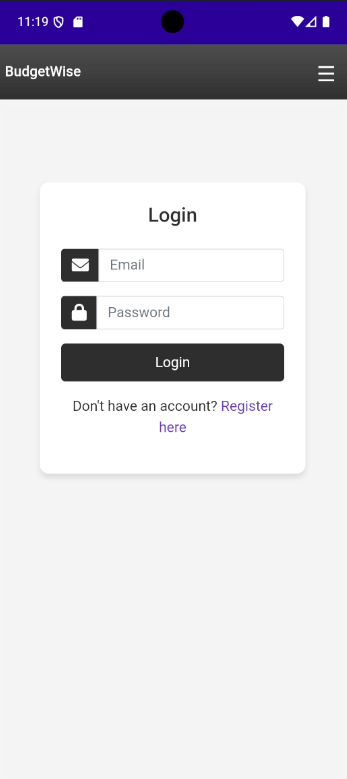           | Login form                 |
| 3 | 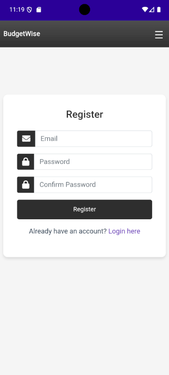        | Register form              |
| 4 | 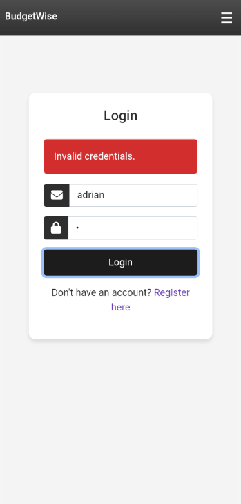     | Invalid credentials banner |

### 2. Dashboard

| # | Screenshot                                    | Description               |
| - | --------------------------------------------- | ------------------------- |
| 5 | 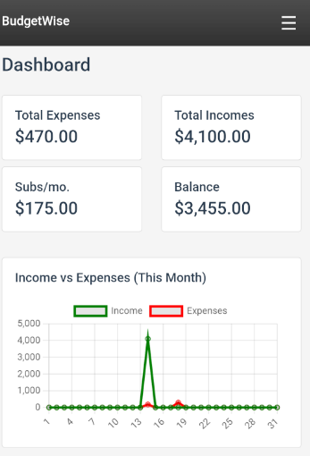 | KPI summary cards         |
| 6 | 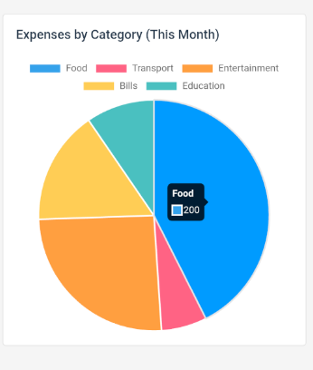        | Income vs Expenses chart  |
| 7 | 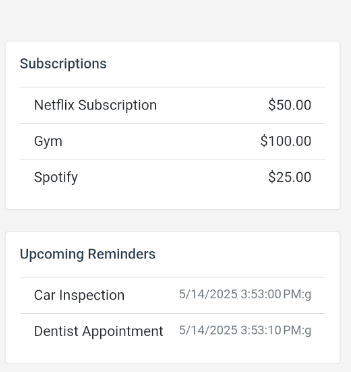         | Expenses by category pie  |
| 8 |      | Subscriptions & reminders |

### 3. Transactions

| #  | Screenshot                                        | Description       |
| -- | ------------------------------------------------- | ----------------- |
| 9  | 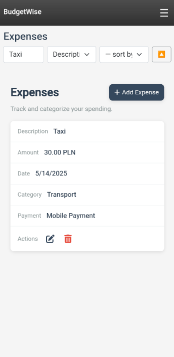 | Expenses list     |
| 10 | 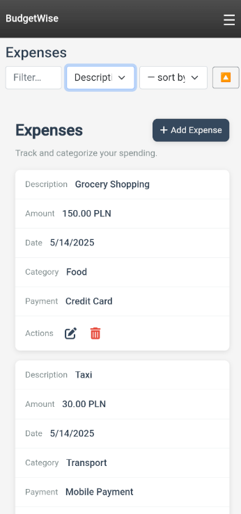  | Filtered expenses |
| 11 | 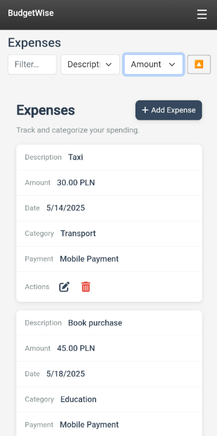    | Sorted expenses   |
| 12 | 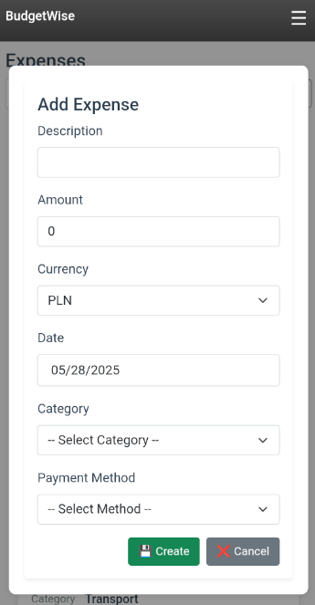     | Add expense modal |
| 13 | 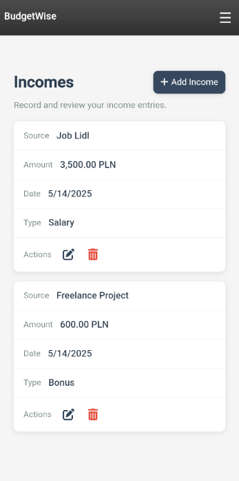          | Incomes list      |
| 14 | 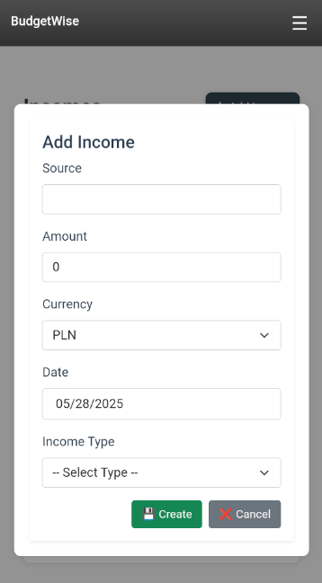      | Add income modal  |
| 15 | 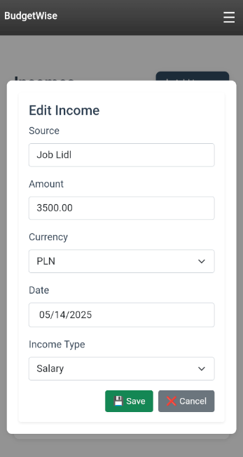     | Edit income modal |

### 4. Monthly Budgets

| #  | Screenshot                               | Description          |
| -- | ---------------------------------------- | -------------------- |
| 16 | 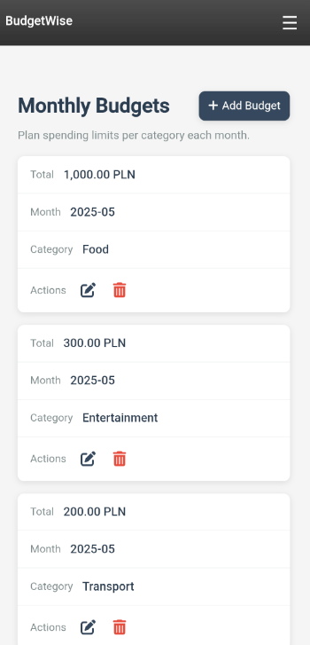 | Budgets per category |

### 5. Categories & Types

| #  | Screenshot                               | Description                |
| -- | ---------------------------------------- | -------------------------- |
| 17 | 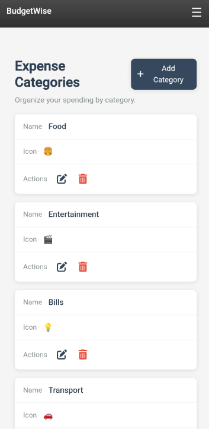   | Expense categories manager |
| 18 | 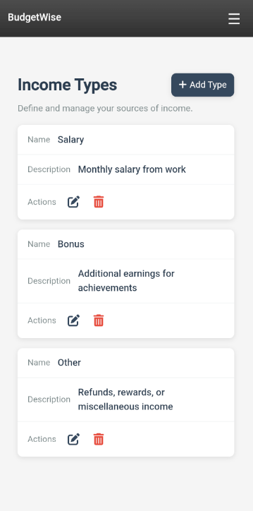 | Income types manager       |

### 6. Goals & Reminders

| #  | Screenshot                            | Description        |
| -- | ------------------------------------- | ------------------ |
| 19 | 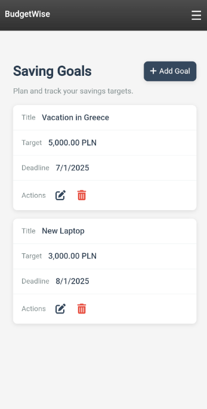     | Saving goals list  |
| 20 | 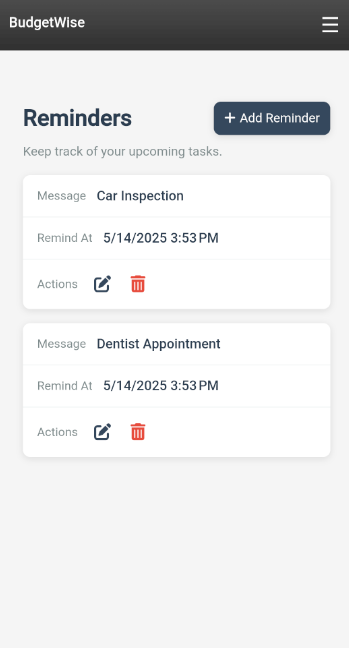 | Upcoming reminders |

### 7. Subscriptions & Payment Methods

| #  | Screenshot                                     | Description             |
| -- | ---------------------------------------------- | ----------------------- |
| 21 | 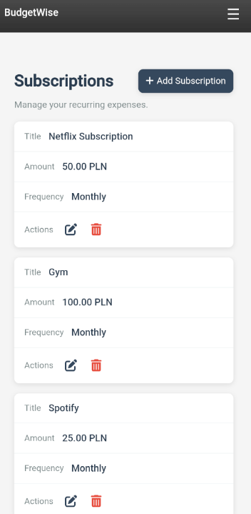 | Subscriptions list      |
| 22 | 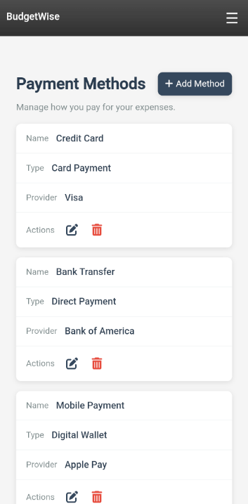    | Payment methods curator |

### 8. Selectors & Navigation

| #  | Screenshot                                  | Description             |
| -- | ------------------------------------------- | ----------------------- |
| 23 | 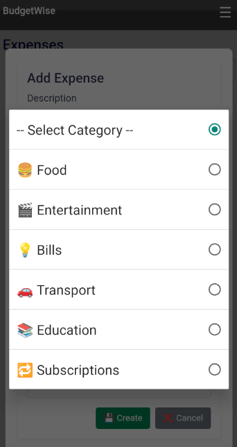 | Category selector       |
| 24 | 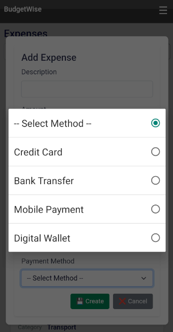   | Payment method selector |
| 25 | 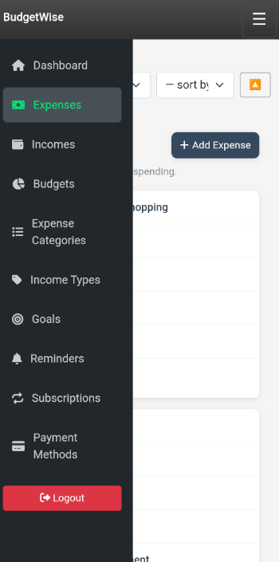     | Main navigation drawer  |

---

## 📄 License

© 2025 – Released under the [MIT License](LICENSE).

---

*Update badges, URLs & connection strings to your environment before pushing to GitHub.*
::contentReference[oaicite:0]{index=0}

