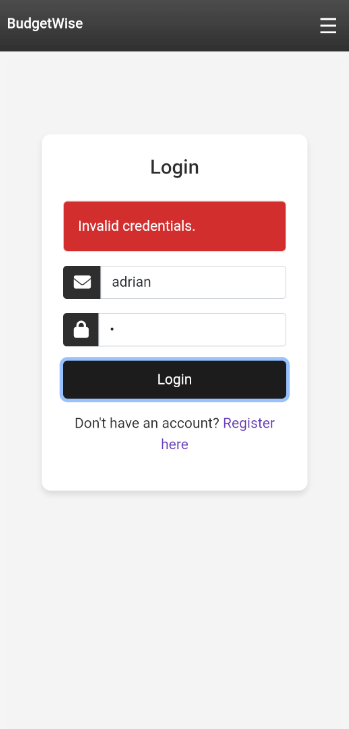
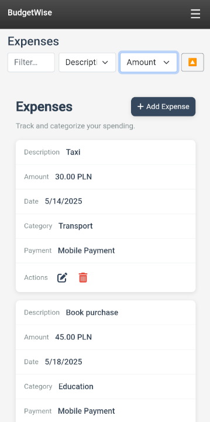

# BudgetWise
Personal Finance Manager (​.NET MAUI + Blazor)

📋 Project Overview

**BudgetWise** is a cross-platform mobile application built with **.NET MAUI** and **Blazor** that helps users:

- Track incomes and expenses
  
- Categorize transactions

- Set and monitor monthly budgets
  
- Plan and measure savings goals
  
- Manage recurring subscriptions
  
- Receive local reminders

It works offline-first with seamless synchronization to a custom **ASP.NET Core Web API** backed by **SQL Server**.

## 🚀 Key Features

- **Authentication**
  
  Sign up, log in, and log out using ASP.NET Core Identity with JWT (IdentityServer4)

- **Dashboard**
    
  - Summary cards: Total Expenses, Total Income, Current Balance, Monthly Subscriptions
     
  - Line chart: “Income vs. Expenses” for the current month
      
  - Pie chart: “Expenses by Category”

- **Transactions CRUD**
  
  - **Expenses** and **Incomes** lists with filtering and sorting
     
  - Add/Edit modals capturing:
     
    - Description, Amount, Currency, Date
        
    - Category (Food, Transport, Education, etc.)
       
    - Payment Method (Credit Card, Bank Transfer, Mobile Payment)
      
    - Income Type (Salary, Bonus, Other)

- **Monthly Budgets**
  
  Define per-category spending limits and track usage

- **Custom Categories & Types**
    
  - Create and edit expense categories (with emoji icons)
      
  - Define income types with descriptions

- **Savings Goals**
    
  Set target amounts with deadlines and view progress

- **Subscriptions & Reminders**
  
  - Manage recurring subscriptions (Netflix, Gym, Spotify…)
     
  - Schedule local notifications for upcoming payments or tasks

- **Offline-First & Sync**
   
  - Local caching with SecureStorage and Preferences
    
  - Retry and circuit-breaker policies (Polly)
      
  - Sync to RESTful Web API (Entity Framework Core, SQL Server)

- **Clean Architecture & Patterns**
  
  - MVVM (CommunityToolkit.Mvvm)
      
  - Dependency Injection (Microsoft.Extensions.DependencyInjection)
      
  - MessagingCenter for event-driven updates
    
  - Behaviors & Triggers for UI enhancements

---

## 🛠 Tech Stack

| Layer            | Technology / Library                          |
| ---------------- | --------------------------------------------- |
| **Mobile UI**    | .NET MAUI + Blazor (Razor), C#               |
| **State Management & DI** | CommunityToolkit.Mvvm, DI Container    |
| **Charts & Icons** | Microcharts, FontAwesome / MaterialIcons    |
| **Local Storage** | SecureStorage, Preferences                    |
| **Web API**      | ASP.NET Core 9, Entity Framework Core, SQL Server |
| **Authentication** | ASP.NET Core Identity, IdentityServer4, JWT  |
| **Networking**   | HttpClient, Polly (retry & circuit breaker)   |
| **Testing**      | xUnit, Moq                                    |

---

## ⚙️ Installation & Setup

REST API (ASP.NET Core Web API + SQL Server)

1. **Clone repository**
2. 
   ```bash
   
   git clone https://github.com/YourUsername/BudgetWise.git
   
   cd BudgetWise

Backend (Web API)


-cd src/Backend

-dotnet ef database update

-dotnet run

Mobile App


-Open BudgetWise.sln in Rider or Visual Studio 2022+

-In appsettings.json, set ApiBaseUrl to your API URL

-Deploy to Android/iOS emulator or physical device


## 🗂️ Screenshots Overview

Below is a full breakdown of all views and components in **BudgetWise**, organized by feature area. Store images under `assets/screenshots/` and reference them by the given filenames.

---

### 1. Pre-Authentication

| # | Screenshot                                             | Filename                    | Description                                                        |
| - | ------------------------------------------------------ | --------------------------- | ------------------------------------------------------------------ |
| 1 |  | `prelogin-drawer.png`       | Side menu on welcome screen, with **Login** / **Register** options |
| 2 |             | `login.png`                 | Email & password form, plus link to registration                   |
| 3 |       | `register.png`              | New account form: Email, Password, Confirm Password                |
| 4 |      | `login-error.png`           | Error banner “Invalid credentials” on failed login                 |

---

### 2. Dashboard

| # | Screenshot                                          | Filename                     | Description                                                                                       |
| - | --------------------------------------------------- | ---------------------------- | ------------------------------------------------------------------------------------------------- |
| 5 |  | `dashboard-summary.png`      | Cards showing Total Expenses, Total Income, Subs/mo., Balance                                      |
| 6 |    | `chart-line.png`             | Line chart (green = income, red = expenses) for current month                                      |
| 7 |   | `chart-pie.png`              | Pie chart breakdown of expense categories                                                          |
| 8 |  | `subscriptions.png`          | Lists recurring subscriptions and upcoming local reminders                                         |

---

### 3. Transactions (Expenses & Incomes)

| #  | Screenshot                                    | Filename                       | Description                                                                                 |
| -- | --------------------------------------------- | ------------------------------ | ------------------------------------------------------------------------------------------- |
| 9  |  | `expenses-list-default.png`     | Expense entries with Description, Amount, Date, Category, Payment Method, edit/delete icons |
| 10 |      | `expenses-list-filter.png`      | Filter bar applied (e.g. “Taxi”)                                                             |
| 11 |          | `expenses-list-sort.png`        | Sorting by Amount                                                                            |
| 12 |         | `add-expense-modal.png`         | Modal for creating a new expense (all fields)                                               |
| 13 |                   | `incomes-list.png`              | Income entries with Source, Amount, Date, Type                                               |
| 14 |           | `add-income-modal.png`          | Modal for adding an income source                                                            |
| 15 |         | `edit-income-modal.png`         | Modal for editing existing income entries                                                    |

---

### 4. Monthly Budgets

| #  | Screenshot                            | Filename                   | Description                                           |
| -- | ------------------------------------- | -------------------------- | ----------------------------------------------------- |
| 16 |  | `budgets-list.png`         | List of per-category budgets (Total, Month, Category) |

---

### 5. Categories & Types

| #  | Screenshot                                | Filename               | Description                                                 |
| -- | ----------------------------------------- | ---------------------- | ----------------------------------------------------------- |
| 17 |  | `categories.png`        | Manage expense categories (Name + Emoji icon)               |
| 18 |     | `income-types.png`      | Define income types with descriptions                       |

---

### 6. Goals & Reminders

| #  | Screenshot                                | Filename                 | Description                                         |
| -- | ----------------------------------------- | ------------------------ | --------------------------------------------------- |
| 19 |      | `goals.png`              | List of savings targets with Title, Target, Deadline |
| 20 |  | `reminders.png`          | Upcoming local notifications for user-defined tasks  |

---

### 7. Subscriptions & Payment Methods

| #  | Screenshot                                        | Filename                      | Description                                              |
| -- | ------------------------------------------------- | ----------------------------- | -------------------------------------------------------- |
| 21 |  | `subscriptions-list.png`      | Recurring subscriptions (Title, Amount, Frequency)       |
| 22 |   | `payment-methods.png`         | Configurable payment methods (Name, Type, Provider)      |

---

### 8. Selectors & Navigation

| #  | Screenshot                                             | Filename                       | Description                                                    |
| -- | ------------------------------------------------------ | ------------------------------ | -------------------------------------------------------------- |
| 23 |  | `select-category.png`          | Native modal to choose an expense category                     |
| 24 |      | `select-method.png`            | Native modal to choose a payment method                        |
| 25 |  | `main-drawer.png`              | Full app menu after login, highlighting **Expenses** section    |

---


